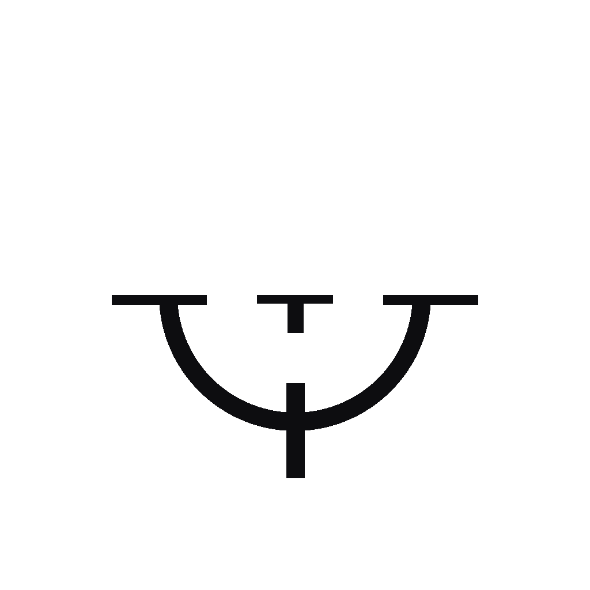

# Contrast Checker

<p align="center">
  
</p>

<p align="center">
  <a href="https://github.com/svinkle/contrast-checker/actions/workflows/macos.yml"></a>
  <a href="https://github.com/svinkle/contrast-checker/actions/workflows/windows.yml"></a>
  <a href="https://github.com/svinkle/contrast-checker/actions/workflows/linux.yml"></a>
  <a href="https://github.com/svinkle/contrast-checker/releases"></a>
</p>

A minimalist, native utility for measuring color contrast anywhere across your operating system—including native windows, virtual machines, web browsers, and desktop wallpaper.

Built for accessibility testing, design system audits, and fast WCAG 2.1 compliance verification.

---

## Downloads

Download the latest pre-compiled binaries from the **[GitHub Releases](https://github.com/svinkle/contrast-checker/releases)** page:

| Operating System | Package Format | Download | Description |
| :--- | :--- | :--- | :--- |
| **macOS** | `.dmg` | [ContrastChecker.dmg](https://github.com/svinkle/contrast-checker/releases/latest) | Apple disk image with drag-and-drop `/Applications` install (Universal: Apple Silicon & Intel) |
| **Windows** | `.exe` | [ContrastChecker.exe](https://github.com/svinkle/contrast-checker/releases/latest) | Standalone single-file portable executable (x64, zero runtime dependencies) |
| **Windows** | `.msi` | [ContrastChecker.msi](https://github.com/svinkle/contrast-checker/releases/latest) | Windows Installer package with Start Menu and Desktop shortcuts |
| **Linux** | `.flatpak` | [ContrastChecker.flatpak](https://github.com/svinkle/contrast-checker/releases/latest) | Universal Flatpak bundle for Ubuntu, Fedora, Arch, Cinnamon, KDE, GNOME, etc. |

---

## Platforms

- **[macOS (`/macos`)](./macos)**: Native Swift, SwiftUI, and AppKit application. Features system-wide eyedropper (`NSColorSampler`), permanent menu bar companion, dynamic Dock icon hiding, and global system shortcuts (`⌃⌥C`, `⌃⌥B`, `⌃⌥F`).
- **[Windows (`/windows`)](./windows)**: Native C#, .NET 8, and WPF application. Features fullscreen magnification loupe eyedropper, permanent system tray companion, standalone single-file `.exe`, WiX `.msi` installer, and global shortcuts (`Ctrl+Alt+C`, `Ctrl+Alt+B`, `Ctrl+Alt+F`).
- **[Linux (`/linux`)](./linux)**: Native GTK 4 application packaged as a universal **Flatpak** bundle. Features clean floating card experience with crisp squared corners, multi-desktop screen color sampling (via FreeDesktop XDG Desktop Portal on Wayland and native X11), and accessible keyboard navigation.

---

## Quick Start & Building from Source

Each operating system provides dedicated build scripts to package release assets:

### macOS

For full documentation, shortcuts, and permissions, see the **[macOS README](./macos/README.md)**.

```bash
# Build the application bundle (build/ContrastChecker.app)
make macos

# Build installable DMG (build/ContrastChecker.dmg)
make dmg
# or run directly: ./macos/create_dmg.sh

# Run automated tests
make test-macos
```

### Windows

For full documentation, shortcuts, and installer details, see the **[Windows README](./windows/README.md)**.

```cmd
:: Build both ContrastChecker.exe and ContrastChecker.msi
windows\build.bat
```

Or using PowerShell / Make:

```powershell
# Build self-contained single-file ContrastChecker.exe
powershell -ExecutionPolicy Bypass -File windows/build.ps1

# Build installable ContrastChecker.msi (via WiX)
powershell -ExecutionPolicy Bypass -File windows/build.ps1 -BuildMsi
```

### Linux

For full documentation, dependencies, and desktop integration, see the **[Linux README](./linux/README.md)**.

```bash
# Run unit tests
make test-linux

# Build standalone ContrastChecker.flatpak bundle
make flatpak
# or run directly: ./linux/build_flatpak.sh

# Install the Flatpak bundle
flatpak install --user ContrastChecker.flatpak
```
